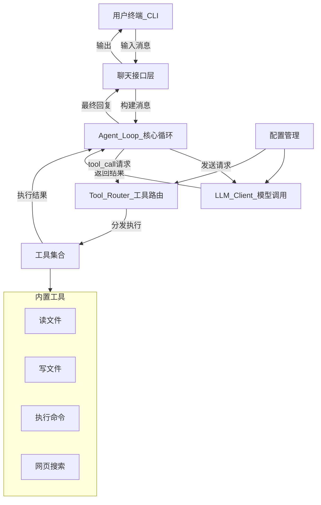

# miniclaw 架构文档

使用 Rust 从零构建一个类似 OpenClaw 的个人 AI 助手工具，涵盖 LLM 调用、Tool Calling、Agent Loop、消息传输、插件系统等核心组件，通过实践学习 AI 工具链的完整架构。

## 工具概述

本项目的目标是用 Rust 构建一个**个人 AI 助手**（`miniclaw`），它的核心能力是：

- 接收用户的自然语言输入（通过 CLI 终端交互）
- 调用 LLM（如 Claude / OpenAI）进行推理
- LLM 可以自主选择并调用**工具（Tools）**来完成任务（如读写文件、执行命令、搜索网页等）
- 工具执行结果会反馈给 LLM，形成**Agent Loop（智能体循环）**
- 支持通过配置/插件扩展新的工具能力

这本质上是一个 **Tool-based AI Agent** 系统。

---

## 整体架构



---

## 核心组件详解

### 1. CLI 聊天接口层（Chat Interface）

**作用**：提供用户与 AI 助手交互的入口，处理输入/输出和流式显示。

**涉及概念**：

- **Terminal UI**：终端交互界面，支持多行输入、流式输出（LLM 的 streaming response 逐 token 显示）
- **对话历史管理**：维护 `Vec<Message>` 作为上下文窗口

**推荐 Crate**：

- `rustyline` - 命令行输入编辑（类似 readline）
- `crossterm` / `ratatui` - 如果需要更丰富的终端 UI
- `tokio` - 异步运行时（整个项目的基础）

**关键文件**：`src/cli.rs`

---

### 2. LLM Client（大模型调用客户端）

**作用**：封装与 LLM API（OpenAI / Anthropic）的 HTTP 通信，发送消息并接收回复。

**涉及概念**：

- **Chat Completions API**：LLM 的核心接口，发送消息列表、接收助手回复
- **Streaming（SSE）**：Server-Sent Events 流式传输，实现逐 token 输出
- **Tool Definition（工具定义）**：告知 LLM 有哪些可用工具，使用 JSON Schema 描述每个工具的名称、描述、参数格式
- **Tool Call（工具调用）**：LLM 返回的结构化数据，表示它希望调用某个工具
- **多 Provider 支持**：通过 trait 抽象不同的模型提供商

**推荐 Crate**：

- `reqwest` - HTTP 客户端
- `serde` / `serde_json` - JSON 序列化/反序列化
- `eventsource-stream` 或 `reqwest-eventsource` - SSE 流处理
- 也可以直接用 `async-openai` crate（OpenAI）或 `llm` crate（多 provider 统一）

**关键代码结构**：

```rust
#[async_trait]
pub trait LlmProvider {
    async fn chat_completion(&self, request: ChatRequest) -> Result<ChatResponse>;
    async fn chat_completion_stream(&self, request: ChatRequest) -> Result<impl Stream<Item = StreamChunk>>;
}
```

**关键文件**：`src/llm/mod.rs`, `src/llm/anthropic.rs`

---

### 3. Agent Loop（智能体循环）-- 核心中的核心

**作用**：这是整个系统的大脑，协调 LLM 与工具之间的多轮交互，直到任务完成。

**涉及概念**：

- **Agent Loop 模式**：一个 while 循环，不断执行：发送消息给 LLM -> 检查回复 -> 如果有 tool_call 就执行工具 -> 把结果放回消息 -> 再次调用 LLM -> 直到 LLM 返回纯文本回复（无 tool_call）
- **消息角色（Role）**：`system`（系统提示词）、`user`（用户）、`assistant`（LLM）、`tool`（工具结果）
- **上下文管理（Context Window）**：LLM 有 token 限制，需要管理消息历史，可能需要截断或摘要
- **最大迭代次数**：防止 Agent 无限循环

**伪代码流程**：

```rust
loop {
    let response = llm_client.chat_completion(&messages).await?;
    messages.push(Message::assistant(response.clone()));

    if response.tool_calls.is_empty() {
        // LLM 直接回复文本，循环结束
        return Ok(response.content);
    }

    for tool_call in &response.tool_calls {
        let result = tool_router.execute(tool_call).await?;
        messages.push(Message::tool(tool_call.id, result));
    }
}
```

**关键文件**：`src/agent.rs`

---

### 4. Tool System（工具系统）

**作用**：定义、注册、路由和执行工具。LLM 通过结构化的 tool_call 请求来调用这些工具。

**涉及概念**：

- **Tool Trait**：统一的工具接口，每个工具实现 `name()`、`description()`、`parameters_schema()`（JSON Schema）、`execute()`
- **JSON Schema**：用于向 LLM 描述工具参数的标准格式，LLM 根据 schema 生成合法参数
- **Tool Router**：根据工具名称分发到对应的工具实现
- **沙箱/权限控制**：某些危险工具（如执行命令）需要用户确认

**工具 Trait 定义**：

```rust
#[async_trait]
pub trait Tool: Send + Sync {
    fn name(&self) -> &str;
    fn description(&self) -> &str;
    fn parameters_schema(&self) -> serde_json::Value;
    async fn execute(&self, params: serde_json::Value) -> Result<String>;
}
```

**内置工具示例**：

- `read_file` - 读取文件内容
- `write_file` - 写入文件
- `exec_command` - 执行 shell 命令
- `web_search` - 搜索网页（调用搜索 API）
- `list_directory` - 列出目录内容

**推荐 Crate**：

- `schemars` - 自动从 Rust struct 生成 JSON Schema
- `tokio::process` - 异步执行子进程

**关键文件**：`src/tools/mod.rs`, `src/tools/read_file.rs`

---

### 5. 配置管理（Configuration）

**作用**：管理 API Key、模型选择、工具启用/禁用、系统提示词等配置。

**涉及概念**：

- **配置文件格式**：使用 TOML 格式存储配置
- **环境变量**：API Key 等敏感信息优先从环境变量读取
- **配置合并**：默认配置 + 用户配置 + 命令行参数的优先级合并

**推荐 Crate**：

- `toml` - TOML 解析
- `config` - 多来源配置合并
- `dirs` - 获取用户目录（`~/.miniclaw/config.toml`）

**配置示例**：

```toml
[llm]
provider = "anthropic"
model = "claude-sonnet-4-20250514"
api_key_env = "ANTHROPIC_API_KEY"
max_tokens = 4096

[agent]
max_iterations = 20
system_prompt = "You are a helpful assistant..."

[tools]
enabled = ["read_file", "write_file", "exec_command"]
```

**关键文件**：`src/config.rs`

---

### 6. 消息与类型系统（Message Types）

**作用**：定义所有在系统中流转的数据结构。

**涉及概念**：

- **Message**：角色 + 内容 + 可选 tool_calls / tool_call_id
- **ToolCall**：工具调用的结构体（id, name, arguments）
- **ChatRequest / ChatResponse**：LLM API 的请求和响应体
- **StreamChunk**：流式响应的增量块

**关键文件**：`src/types.rs`

---

## 项目结构

```
miniclaw/
  Cargo.toml
  docs/
    ARCHITECTURE.md   # 本文档
  src/
    main.rs           # 入口，初始化各组件
    cli.rs            # CLI 聊天接口
    config.rs         # 配置管理
    types.rs          # 核心数据类型
    agent.rs          # Agent Loop 核心循环
    llm/
      mod.rs          # LlmProvider trait 定义
      anthropic.rs    # Anthropic 实现
    tools/
      mod.rs          # Tool trait + ToolRouter
      read_file.rs    # 读文件工具
```

---

## 关键学习概念总结

| 组件 | 核心概念 |
|------|----------|
| LLM Client | Chat Completions API, Streaming/SSE, HTTP 请求 |
| Agent Loop | 多轮工具调用循环, 上下文管理, 消息角色 |
| Tool System | JSON Schema, Function Calling, Trait 抽象 |
| CLI | 异步 I/O, 流式输出, 终端交互 |
| 配置 | TOML 解析, 环境变量, 配置合并 |
| 整体 | async/await, Tokio 运行时, Trait 多态, 错误处理(anyhow/thiserror) |

---

## 实施路线（渐进式开发）

分 6 个阶段，每个阶段可独立运行验证：

1. **阶段 1**：搭建项目骨架 + 配置管理 + 类型定义 ✅
2. **阶段 2**：实现 LLM Client（先支持 Anthropic），验证能正常对话
3. **阶段 3**：实现 Agent Loop 核心循环（无工具版本），能进行多轮对话
4. **阶段 4**：实现 Tool System 框架 + 第一个工具（`read_file`），验证完整的 tool calling 流程
5. **阶段 5**：丰富内置工具集（write_file, exec_command, list_dir 等）
6. **阶段 6**：完善 CLI 体验（流式输出、错误处理、对话历史持久化）

## 数据流

当用户输入一句话时，数据的完整流动路径：

```
用户输入 "读取 Cargo.toml"
  → cli.rs 接收输入
  → agent.rs 将输入加入消息历史，调用 LLM
  → llm/anthropic.rs 将消息转为 API 格式，发送 HTTP 请求
  → Anthropic API 返回 tool_call: read_file(path="Cargo.toml")
  → agent.rs 检测到 tool_call，交给 ToolRouter
  → tools/mod.rs 按名称找到 read_file 工具并执行
  → tools/read_file.rs 读取文件内容
  → agent.rs 将结果作为 tool message 加入历史，再次调用 LLM
  → LLM 看到文件内容，生成最终文字回复
  → cli.rs 显示回复
```
