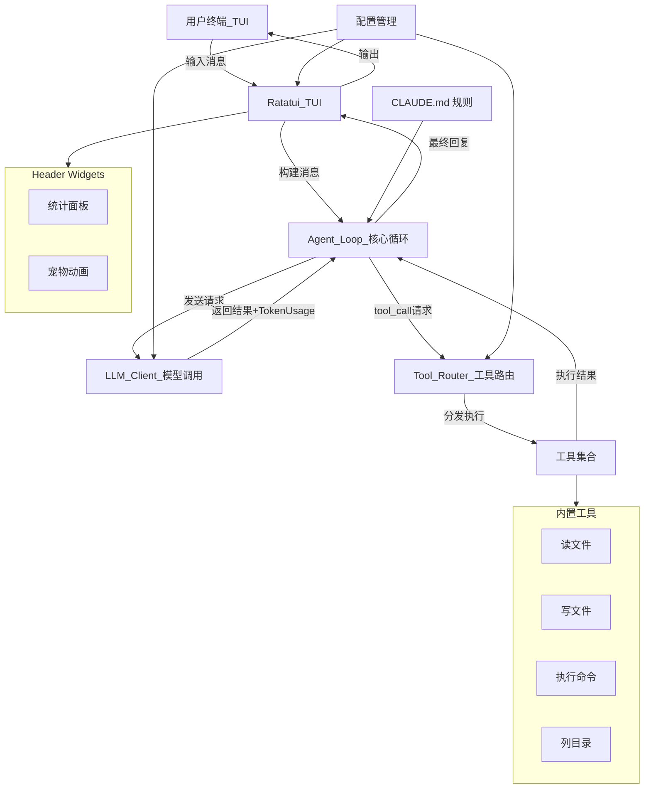

# miniclaw 架构文档

使用 Rust 从零构建一个类似 OpenClaw 的个人 AI 助手工具，涵盖 LLM 调用、Tool Calling、Agent Loop、消息传输、插件系统等核心组件，通过实践学习 AI 工具链的完整架构。

## 工具概述

本项目的目标是用 Rust 构建一个**个人 AI 助手**（`miniclaw`），它的核心能力是：

- 接收用户的自然语言输入（通过 ratatui TUI 终端交互）
- 调用 LLM（如 Claude / OpenAI 兼容 API）进行推理
- LLM 可以自主选择并调用**工具（Tools）**来完成任务（如读写文件、执行命令、搜索网页等）
- 工具执行结果会反馈给 LLM，形成**Agent Loop（智能体循环）**
- 支持通过配置/插件扩展新的工具能力
- TUI 的 header 面板使用**插件化 Widget 系统**，可动态开关

这本质上是一个 **Tool-based AI Agent** 系统。

---

## 整体架构



---

## 核心组件详解

### 1. TUI 界面层（Ratatui）

**作用**：提供用户与 AI 助手交互的终端界面。

**布局**：

```text
┌─ miniclaw ─────────────────┬── Pet ──────┐  ← header (插件化 widgets)
│  ■ READY                   │    /\_/\    │
│  In: 1.2K  Out: 0.8K      │   ( o.o )   │
│  Requests: 5  Day: 3       │    > ^ <    │
│                            │    Idle     │
├─ Conversation ─────────────┴─────────────┤  ← 对话区 (可滚动)
│ You: 你好                                │
│ Assistant: 你好！有什么...               │
├─ Input ──────────────────────────────────┤  ← 输入框
│ > _                                      │
└──────────────────────────────────────────┘
```

**关键特性**：

- **HeaderWidget 插件系统**：通过 `HeaderWidget` trait 实现可插拔的 header 面板
- **StatsWidget**：显示 token 统计、请求次数、使用天数
- **PetWidget**：ASCII 宠物动画（7 种心情状态）
- **动态开关**：`/stats`、`/pet` 命令运行时切换；`[ui]` 配置段设置默认值
- **UTF-8 安全**：正确处理 CJK 宽字符的光标定位

**关键文件**：`src/ui/mod.rs`, `src/ui/ratatui_ui.rs`

---

### 2. LLM Client（大模型调用客户端）

**作用**：封装与 LLM API 的 HTTP 通信。

**涉及概念**：

- **Chat Completions API**：发送消息列表、接收助手回复
- **Tool Definition**：通过 JSON Schema 描述可用工具
- **Tool Call**：LLM 返回的结构化调用请求
- **TokenUsage**：从 API 响应中提取 input/output token 使用量
- **多 Provider 支持**：通过 trait 抽象

**Trait 定义**：

```rust
#[async_trait]
pub trait LlmProvider: Send + Sync {
    async fn chat_completion(&self, request: &ChatRequest) -> Result<ChatResponse>;
    async fn chat_completion_stream(
        &self, request: &ChatRequest, chunk_tx: mpsc::UnboundedSender<StreamChunk>,
    ) -> Result<ChatResponse>;  // 默认回退到非流式
    fn name(&self) -> &str;
}
```

**已实现 Provider**：

- `AnthropicProvider` — Anthropic Messages API（Claude）
- `OpenAiCompatibleProvider` — OpenAI / Qwen / DeepSeek / Moonshot / Ollama 等

**关键文件**：`src/llm/mod.rs`, `src/llm/anthropic.rs`, `src/llm/openai_compatible.rs`

---

### 3. Agent Loop（智能体循环）

**作用**：协调 LLM 与工具之间的多轮交互。

**流程**（使用流式 SSE 输出）：

```rust
loop {
    let (chunk_tx, chunk_rx) = mpsc::unbounded_channel();
    // 转发任务：将 StreamChunk → AgentEvent::StreamDelta 发送给 TUI
    let forward = tokio::spawn(forward_chunks(chunk_rx, event_tx));

    let response = llm.chat_completion_stream(&request, chunk_tx).await?;
    forward.await;  // 等待所有 chunk 转发完毕
    stats.record_usage(&response.usage);

    if response.tool_calls.is_empty() {
        return Ok(response.content);  // 纯文本回复，循环结束
    }

    for tool_call in &response.tool_calls {
        let result = tool_router.execute(tool_call).await;
        messages.push(Message::tool_result(tool_call.id, result));
    }
    // 继续循环，LLM 将看到工具结果
}
```

**SessionStats**：累计追踪 `total_input_tokens`、`total_output_tokens`、`request_count`。

**关键文件**：`src/agent.rs`

---

### 4. Tool System（工具系统）

**Trait 定义**：

```rust
#[async_trait]
pub trait Tool: Send + Sync {
    fn name(&self) -> &str;
    fn description(&self) -> &str;
    fn parameters_schema(&self) -> serde_json::Value;
    async fn execute(&self, params: serde_json::Value) -> Result<String>;
}
```

**ToolRouter**：按名称注册和分发工具调用。

**当前工具**：

| 工具 | 文件 | 状态 |
|------|------|------|
| `read_file` | `src/tools/read_file.rs` | 已注册 |
| `write_file` | `src/tools/write_file.rs` | 已实现，未注册 |
| `exec_command` | - | 未实现 |
| `list_directory` | - | 未实现 |

**关键文件**：`src/tools/mod.rs`

---

### 5. 规则文件系统（Rules / CLAUDE.md）

**作用**：发现并加载项目的 CLAUDE.md 规则文件，将其内容注入 Agent 的 system prompt。

**查找策略**（模仿 Claude Code 的行为）：

1. 从项目根目录向上遍历到文件系统根，收集沿途的 `CLAUDE.md` 和 `.claude/CLAUDE.md`
2. 加载 `<project_root>/CLAUDE.md`
3. 加载 `<project_root>/.claude/CLAUDE.md`

**注入方式**：

所有规则文件的内容按层级拼接，用 `<project_rules>` XML 标签包裹后追加到 system prompt 尾部。

**关键文件**：`src/rules.rs`

---

### 6. 配置管理（Configuration）

**配置文件**：`~/.miniclaw/config.toml`

```toml
[llm]
provider = "openai_compatible"
model = "qwen-plus"
api_base = "https://dashscope.aliyuncs.com/compatible-mode/v1"
api_key = ""
api_key_env = "LLM_API_KEY"
max_tokens = 4096

[agent]
max_iterations = 20
system_prompt = "..."

[tools]
enabled = ["read_file", "write_file", "list_directory", "exec_command"]

# 多模型时，每个 [[llm.models]] 可配置 tools（空=全部）、enable_search（qwen3.5-plus 联网搜索）

[ui]
show_stats = true
show_pet = true
```

**环境变量覆盖**：`MINICLAW_PROVIDER`, `MINICLAW_MODEL`, `MINICLAW_API_BASE`

**关键文件**：`src/config.rs`

---

### 7. 消息与类型系统（Message Types）

- **Message**：role + content + tool_calls + tool_call_id
- **ToolCall**：id + name + arguments
- **ChatRequest / ChatResponse**：LLM 请求/响应（含 `usage: Option<TokenUsage>`）
- **TokenUsage**：input_tokens + output_tokens
- **StreamChunk**：流式响应增量块（`TextDelta` / `Done`），由 LLM Provider 通过 mpsc channel 发送

**关键文件**：`src/types.rs`

---

## 项目结构

```
miniclaw/
├── Cargo.toml
├── CLAUDE.md                 # Claude Code 项目规则
├── docs/
│   ├── ARCHITECTURE.md   # 本文档
│   └── ROADMAP.md        # 项目规划与实现状态
├── .cursor/rules/
│   └── project-guide.mdc # AI 会话引导
└── src/
    ├── main.rs               # 入口
    ├── config.rs             # 配置管理
    ├── rules.rs              # CLAUDE.md 规则发现与加载
    ├── types.rs              # 核心数据类型
    ├── agent.rs              # Agent Loop + SessionStats
    ├── llm/
    │   ├── mod.rs            # LlmProvider trait
    │   ├── anthropic.rs      # Anthropic 实现
    │   └── openai_compatible.rs  # OpenAI 兼容实现
    ├── tools/
    │   ├── mod.rs            # Tool trait + ToolRouter
    │   ├── read_file.rs      # 读文件工具
    │   └── write_file.rs     # 写文件工具
    └── ui/
        ├── mod.rs            # HeaderWidget trait + WidgetContext
        └── ratatui_ui.rs     # TUI 实现（StatsWidget, PetWidget, 宠物动画）
```

---

## 数据流

```
用户输入 "读取 Cargo.toml"
  → ratatui_ui.rs 接收输入
  → agent.rs 将输入加入消息历史，调用 LLM（流式 SSE）
  → llm/*.rs 将消息转为 API 格式，发送 HTTP 请求（stream=true）
  → SSE 流逐 token 返回：StreamChunk::TextDelta → AgentEvent::StreamDelta → TUI 实时渲染
  → SSE 流中检测到 tool_call（增量累加 arguments）
  → agent.rs 记录 token 用量，检测到 tool_call，交给 ToolRouter
  → tools/mod.rs 按名称找到 read_file 工具并执行
  → tools/read_file.rs 读取文件内容
  → agent.rs 将结果作为 tool message 加入历史，再次调用 LLM（流式 SSE）
  → LLM 流式生成最终文字回复 → TUI 逐 token 渲染
  → ratatui_ui.rs 渲染完成，StatsWidget 更新 token 计数
```
